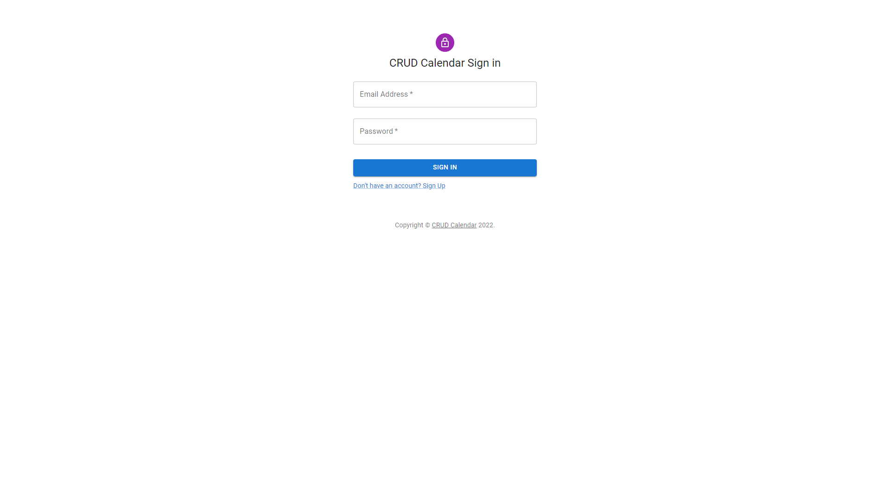
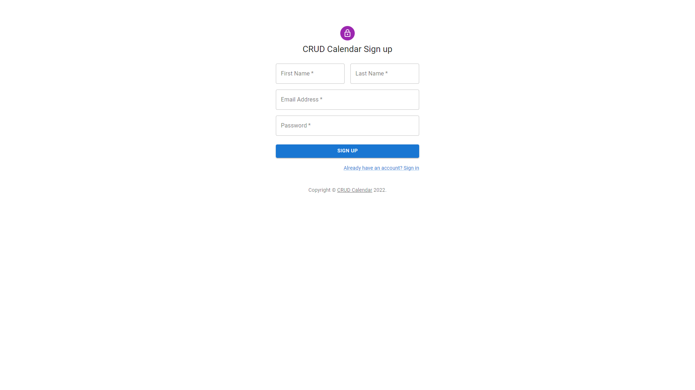
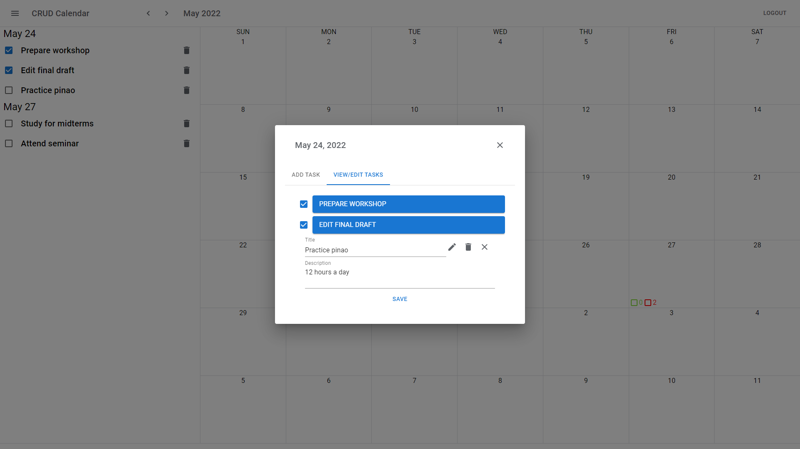

# Crud Calendar

This project is a full stack MERN Calendar Applicaiton that Allows you to Create, Read, Update, and Delete Tasks 

Sign up and add your tasks: https://jdl-crud-calendar.web.app/

## Project Details

This project was bootstrapped with React + Express + MongoBD and was deployed with Firebase for the Frontend and Heroku for the Backend

## Preview

## To start development

1. Clone the project
2. Run `npm install` from the client and server directory
3. Run `npm run dev` from the client and server directory
4. Navigate to the following directory client/src/api/index and change the API endpoint to "http://localhost:3000" 

The server will be listening on port 5000 by default.\
The client will be running on port 3000 by default.

Open http://localhost:3000 to view it in the browser
